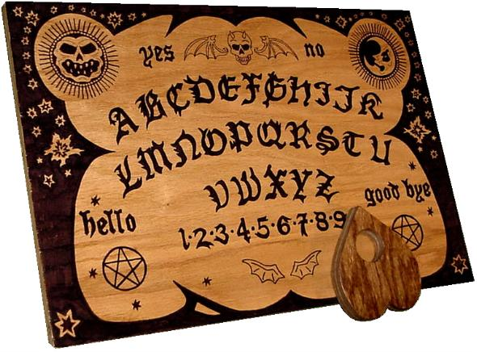

> [!WARNING]  
> Odpowiedzi są wygenerowane przez ChatGPT  
> Ostatnia Edycja: 15.03.2025

# Tablica Ouija – Opis i Historia

## Czym jest tablica Ouija?

Tablica Ouija to narzędzie spirytystyczne używane do rzekomego komunikowania się z duchami. Składa się z płaskiej
powierzchni z literami alfabetu, cyframi 0–9, słowami „TAK” i „NIE” oraz czasem „WITAJ” i „DO WIDZENIA”. Używa się jej
razem z planchette – małą ruchomą wskazówką, na którą uczestnicy kładą palce, aby prowadzić komunikację.

## Historia

- **XIX wiek** – Początki tablicy Ouija są związane z ruchem spirytystycznym, który zyskał popularność w USA i Europie.
- **1890 rok** – Elijah Bond opatentował tablicę jako grę planszową.
- **1901 rok** – William Fuld przejął produkcję i uczynił ją popularnym narzędziem „do kontaktu z zaświatami”.
- **1966 rok** – Parker Brothers (później Hasbro) przejęło prawa do tablicy, traktując ją jako produkt rozrywkowy.

## Jak działa?

- Uczestnicy kładą palce na planchette i koncentrują się na pytaniach.
- Planchette zaczyna się poruszać, wskazując litery i cyfry.
- Wierzący twierdzą, że to duchy kierują ruchem, a sceptycy uważają, że to efekt ideomotoryczny (podświadome ruchy
  uczestników).

## Kontrowersje i wierzenia

- **Zwolennicy**: Uważają, że tablica umożliwia kontakt z duchami i uzyskanie odpowiedzi na pytania.
- **Sceptycy**: Tłumaczą zjawisko efektem ideomotorycznym i uważają tablicę za grę bez nadprzyrodzonych właściwości.
- **Religia**: Wiele religii, w tym chrześcijaństwo, ostrzega przed używaniem tablicy Ouija jako formy okultyzmu.

## Ciekawostki

- W popkulturze pojawia się w horrorach, np. *Egzorcysta* (1973).
- Była przedmiotem wielu miejskich legend i historii o opętaniach.
- Hasbro nadal sprzedaje tablice jako grę towarzyską.

## Podsumowanie

Tablica Ouija to kontrowersyjne narzędzie, które dla jednych jest zabawką, a dla innych bramą do świata duchów. Bez
względu na przekonania, budzi emocje i pozostaje elementem popkultury.