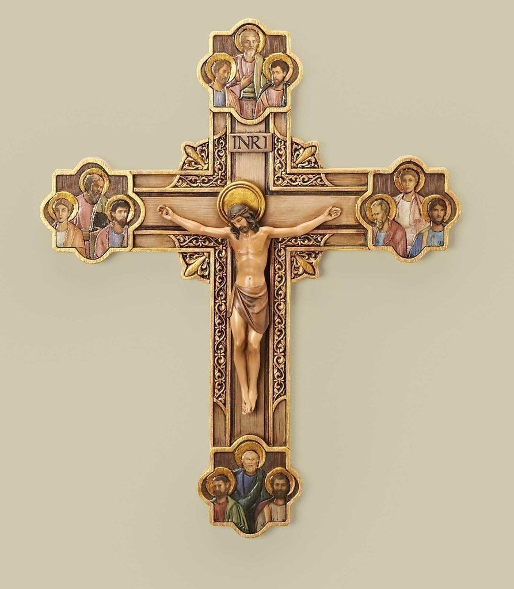

> [!WARNING]
> Odpowiedzi są wygenerowane przez ChatGPT  
> Ostatnia Edycja: 15.03.2025

### **Krucyfiks – Symbol i Działanie**

#### **1. Czym jest krucyfiks?**

Krucyfiks to przedstawienie Jezusa Chrystusa ukrzyżowanego na krzyżu. Jest to jeden z najważniejszych symboli
chrześcijaństwa, szczególnie w katolicyzmie i prawosławiu. W przeciwieństwie do zwykłego krzyża, krucyfiks zawiera
postać Chrystusa (tzw. Corpus Christi).

#### **2. Znaczenie duchowe krucyfiksu**

Krucyfiks symbolizuje:

- **Zbawienie** – przypomina o męce, śmierci i zmartwychwstaniu Chrystusa.
- **Zwycięstwo nad złem** – Jezus przez swoją ofiarę pokonał grzech i szatana.
- **Ochronę** – według tradycji chrześcijańskiej, obecność krucyfiksu odstrasza złe moce.
- **Miłość i poświęcenie** – przypomina wiernym o Bożej miłości i gotowości do poświęcenia dla bliźnich.

#### **3. Jak działa krucyfiks?**

Krucyfiks nie jest „magiczny”, ale działa na zasadzie **mocy duchowej i wiary**. W tradycji chrześcijańskiej przypisuje
się mu następujące działania:

✅ **Ochrona przed złym duchem** – w egzorcyzmach i modlitwach ochronnych kapłani używają krucyfiksu, aby wypędzać złe
duchy.

✅ **Źródło pocieszenia** – patrzenie na krucyfiks w trudnych chwilach przypomina o cierpieniu Jezusa, co daje siłę i
nadzieję.

✅ **Pomoc w modlitwie** – wierni często trzymają krucyfiks w rękach podczas modlitwy, aby skupić się na Chrystusie.

✅ **Przypomnienie o wierze** – noszenie krucyfiksu (np. na szyi) pomaga pamiętać o chrześcijańskich wartościach.

✅ **Poświęcony krucyfiks** – kiedy kapłan poświęci krucyfiks, staje się on sakramentalią, czyli przedmiotem niosącym
duchowe błogosławieństwo.

#### **4. Krucyfiks a egzorcyzmy**

W egzorcyzmach krucyfiks odgrywa kluczową rolę:

- Kapłan używa go, aby „pokazać” złemu duchowi moc Chrystusa.
- Demony reagują na obecność krucyfiksu, co pokazuje jego duchową siłę.
- Święty Benedykt polecał noszenie krucyfiksu z medalikiem, co zwiększa jego działanie ochronne.

#### **5. Jak korzystać z krucyfiksu?**

- **Mieć go w domu** – najlepiej nad drzwiami lub łóżkiem jako znak ochrony.
- **Noszenie na szyi** – przypomnienie o wierze i duchowa tarcza przed pokusami.
- **Używać w modlitwie** – np. trzymając go w ręce, modląc się o siłę i ochronę.
- **Podczas burzy i niebezpieczeństwa** – wierni od wieków wznoszą krucyfiks w modlitwie o ochronę.

#### **Podsumowanie**

Krucyfiks to nie tylko religijny symbol, ale też duchowa broń przeciw złu. Jego działanie opiera się na wierze i mocy
Chrystusa, który na krzyżu pokonał śmierć i szatana. W tradycji katolickiej jest używany w egzorcyzmach, modlitwach
ochronnych i codziennym życiu jako znak Bożej obecności.